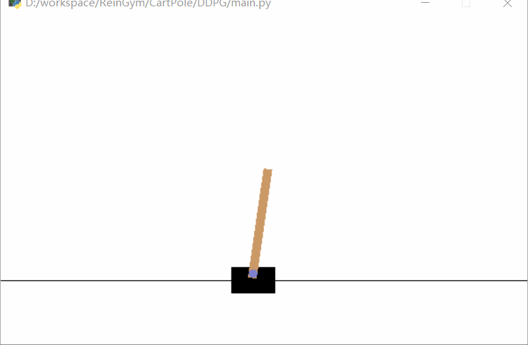

# CartPole

CartPole任务最早由论文Neuronlike Adaptive Elements That Can Solve Difficult Learning Control Problem提出，是一个经典的强化学习控制问题。

## 基本信息

### State Space

状态信息包括小车位置、速度、杆的角度、速度等。我们不需要知道每个数值的具体意义，因为我们可以让强化学习算法自动学习环境信息。

### Action Space

算法给小车施加一个正向或者负向的力，因此Action Space非常简单，此处只有0和1。同样，我们也不知道0和1的具体含义，强化学习算法会自动学习到这些编码身后的含义。

### Reward

只要不让游戏失败，Agent每坚持一步就会获得+1奖励。

### Game Over

当小车偏离中心2.4个单位的距离，或者杆的倾斜角超过15度，那么一轮模拟结束。

## 算法实现

这里拟采用DQN、DDPG、A3C完成模拟，采用TensorFlow框架。

## Tips

